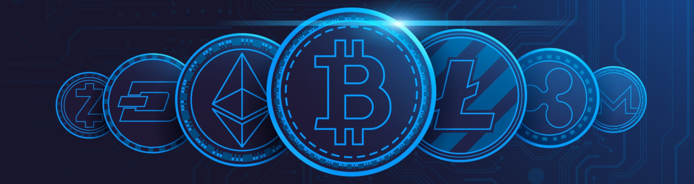

<!-- >___ -->
[](https://nodesource.com/products/nsolid)

# 🏴‍☠️ Crypto Checker for Wallets & Extensions 

Open-source software for working with various cryptocurrency wallets/extensions. Built with a range of advanced features for dumping, cracking and checking cryptocurrency wallets efficiently and accurately.

## 🪧 Introduction

`WalletDumper` enabled you to quickly process and check the balances of wallets. The software is fully open-source and written in NodeJS, which ensures a fantastic processing speed⚡ and simple installation.

You can think of the software as a multi-functional software with 2 main modules: `dumper` and `checker`. They work together in a standard way in order to find, crack, extract and check the balances of wallets.

We dedicate great effort towards ensuring the software is able to process all versions of a wallet so that it is are able to extract everything🦩 For example `Metamask` has 2 encryption schemas according to old versions before 2022 and those created after 2022. The same is true with `wallets.dat` which has BerkleyDB wallets (old) and SQLite wallets (new). Another example is `Phantom`, which introduced the ability to import mnemonics, so that the wallet can hold multiple `mnemonics`. Most wallets today support `imported privkeys`, and our software guarantees the ability to extract them, together with all other relevant data. If you wish only to dump wallets and their privkeys, seeds and mnemonics you can simply skip balance checking and in turn, the software does not even require internet.

The point of these examples is to highlight the fact that we care about these details that our competitors so often seem to skip. Our goal is simply to gain a reputation over the next years as the best on the market.

## 🕴️ Key features
- Cross-platform *(windows/linux)*
- Custom bruteforce scripts for each supported wallet
- HashCat integrated for maximum cracking speed - *optional*
- Integrated balance checker which checks all dumped wallets - *optional*
- Balance checker will check both locked/open wallets
- Automatically derive privkeys at different derivation paths
- Memory efficient and able to handle large volumes of 50k+ wallets
- Efficient duplicate detection so that we don't process duplicated wallets
- Customizable Cracking levels & Password rules
- Change settings, alot of settings to customize your scans
- Clean and easy to read output formats

There are many more functions and features, but the above showcases the general point of the software. You can read about the specifics of the `dumper` and `checker` below in their own separate sections.


## 💼 Getting Started
- The software is easy to use and offers a simple command line with interactive options
- API keys, Path to folders and all user-input is handled by the `config.json` file

### `installing` and `configuring` the software:

#### Installation:
1. Download Node.js® at [https://nodejs.org](https://nodejs.org)
2. Install dependencies
   ```sh
   ~$ cd ./walletdumper
   ~$ npm install
   ```
#### Configurations:
- Get Debank API key at [https://cloud.debank.com](https://cloud.debank.com)
- Get Solana API key at [https://solanatracker.io](https://www.solanatracker.io/account/data-api)
1. Open `config.json`
2. Enter API keys:
   ```json
   "API_KEYS": {
      # leave empty if you will not check balances
      "DEBANK_API_KEY": "YOUR KEY HERE",
      "SOLANATRACKER_API_KEY": "YOUR KEY HERE"
   }
   ```
3. Enter the folder you're scanning:
   ```json
   // use forward slashes
   "SCAN_THIS": "/home/path/to/folder",
   ```
4. Finished, you can run the software:
   ```js
   // run the software
   ~$ node main.js
   ```
**The `setup` is finished. Next step is about customizing `settings` to your specific use-case.**


## ⚙️ Settings
>I recommend everyone - study the settings in order to understand the capabilities and limits of the software. This section will explain all settings, what they do and how to use them for different cases.
- Settings are changed by simple syntax `enable/disable`

### There are currently 3 settings modules in `config.json`:
- `CUSTOM`: misc settings
- `MODULES`: Each wallet that the software supports has its own settings here
- `EXTENSIONS`: plugins/add-ons that was built on top of the software

### `MODULES`:
```json
   // As an example, we will use metamask's settings-module:

   "metamask": {
         "enabled": true,             // include metamask in the scan
         "crack_with_hashcat": true,  // crack metamask with hashcat
         "crack_with_custom": false,  // crack metamask with bruteforce
         "cracking_level": 1,         // read below, level = 1-5
         "output": {
               "output_enabled": true,// enable output to file for metamask? (true/false)
               "write_mnemonics": true,
               "write_addresses": true,
               "write_privatekeys": true,
               "write_uncracked_hashcat_hashes": true,
               "write_hardware_protected_addresses": true,
               "write_cracked_vaults_with_password_and_path": true,
               "write_uncracked_vaults_with_hashcat_and_path": true
         }
   },

   // Cracking levels;
   "cracking_level":
      1 = use only passwords found in the log of the specific wallet
      2 = use passwords from all logs that has a "metamask" wallet
      3 = use passwords from all logs that has a wallet (any wallet type)
      4 = use ALL passwords we found from the entire "SCAN_THIS" folder
      5 = use passwords from your own passwordfile
   
   // If you want to crack without hashcat:
      set "crack_with_custom": true, and "crack_with_hashcat": false
   
   // if you want to disable cracking completely:
      set both to false.
```


### `CUSTOM`:
```json
	"CUSTOM": {
	   "passwordlist": "/path/to/custom-passwords.txt",
		"skip_fake_wallets": true, // skip processing known fake wallets?
		"output_passwords": false, // output all collected passwords to results file?
		"skip_LevelDB": false,     // skip processing all LevelDB wallets?
		"MIN_BALANCE_LOGGING": 0   // minimum balance for logging in the command line
	}

   // passwordlist:
      path to the file to use when you set "cracking_level" to 5.
      1 password per line
   
   // skip_fake_wallets:
      add addresses or hash160 of known fake addresses to the file "FAKE.json".data array to skip it.
      currently supported for: BTC, BCH, LTC, DOGE, DASH, ZCASH

   // output_passwords:
      outputs collected passwords from the scan to the results folder

   // skip_levelDB:
      If you're scanning large volumes and is not intrested in LevelDB wallets, enable this to true
      For example if you are only intrested in Electrum/wallets.dat - enabling this give great speed
   
   // MIN_BALANCE_LOGGING:
      controls the limit of logging a balance to command line
      for example set to 10, and only balances over 10$ will appear in command line.
      great way to prevent spam in cli (results under 10$ are still saved to results)
```

### `EXTENSIONS`:
```json
	"EXTENSIONS": {
		"LummaC2_to_telegram": {
			"enabled": false,
			"check_balances": false
		},
		"crack_with_rules": {
			"enabled": false,          // enable crack_with_rules
			"rule_file": "best66.rule" // the rule that's applied to each password
		}
	}

   // LummaC2_to_telegram
      Contact by PM in forums to get this integration.
   
   // crack_with_rules
      this plugin applies rules to each password, identical to rule-cracking in hashcat
      rule files can be found in "src/plugins/crack_with_rules/rules"
      add your own rule files in the folder above and set "rule_file": "your_file.rule"
      minimum cracking level for rules to be applied is 2.
      works for both "crack_with_custom" and "crack_with_hashcat".
      * requires the hashcat binary file in PATH
```


## FAQ

### `How can i set up the balance checker for BTC, BCH, LTC, DOGE, DASH, ZCASH?`
>In order to check balances of these coins at an efficient speed, it needs to be done by blockchain dumps. First we need to download a few blockchain dumps (total 4GB), and then we populate the software with these dumps. Follow the simple steps below:
>
>1. `Download dumps for the chains you are intrested in:`
>
>   | Coin | download |
>   | ------ | ------ |
>   | Bitcoin | https://gz.blockchair.com/bitcoin/addresses/ |
>   | Bitcoin-cash | https://gz.blockchair.com/bitcoin-cash/addresses/ |
>   | Litecoin | https://gz.blockchair.com/litecoin/addresses/ |
>   | Dogecoin | https://gz.blockchair.com/dogecoin/addresses/ |
>   | Dash | https://gz.blockchair.com/dash/addresses/ |
>   | Zcash | https://gz.blockchair.com/zcash/addresses/ |
>
>   The speed is slow, and you can only download 1 file at a time. (total 4hrs)
>
>   In the future we will integrate a script that fetches all these files and populates the software with updated blockchain dumps in 30 minutes, essentially eliminating all the steps here, and instead it will be as simple as running a command `"npm run update_blockchains"`.
>
>2. `prepare the files`:
>
>   - Place the files in "/src/blockchain_dumps"
>   - Unzip each of the .gz files
>   - rename files to: `bitcoin`, `litecoin`, `doge`, `dash`, `bitcoin-cash`, `zcash`
>   - remove the file extension of each file
>
>3. `Populate the software with the dumps`:
>   ```sh
>   ~$ cd ./walletdumper
>   ~$ npm run update_blockchains
>   ```
> Wait for it to finish, and run the software as normal.
> 
> Keep in mind the fact that transactions on these coins are only updated when you update the chain dumps.
>
